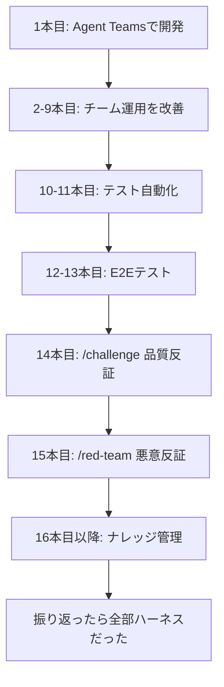

# 自分たちの11スキルはハーネスの全要素をカバーしていた

> **TL;DR**: ハーネスエンジニアリングの5要素（Guard/Context/Tool/Memory/Supervision）を調べたら、15本の記事で作ってきたスキルが全部当てはまった。名前を知らなかっただけ。

## 自分たちの実装をGCTMSにマッピングする

| 要素 | 自分たちの実装 |
|---|---|
| **G（Guard）** | settings.jsonの自動承認設定、/red-teamでの安全性チェック、/challengeの偽陽性フィルタ |
| **C（Context）** | CLAUDE.md、ARCHITECTURE.md、spec、/noteの5フォルダ |
| **T（Tool）** | /spec, /plan, /challenge, /red-team, /test-it, /test-e2e, /note, /checker, /research, /article |
| **M（Memory）** | MEMORY.md、/noteの5フォルダ（decisions/ideas/research/inbox/logs）、retro.md |
| **S（Supervision）** | /challenge（品質反証）、/code-review（公式プラグイン）、retroフィードバックループ、55点→70点→75点のスコア追跡 |

## 記事としてのストーリー

15本の記事は「ハーネスエンジニアリングの実践記録」だった。各記事が1つ以上のハーネス要素を強化していた。

## 次のアクション

- ハーネスエンジニアリング解説＋自分の実装との比較記事を書く
- 過去15本の記事をGCTMS視点で振り返る総括記事にもなる
