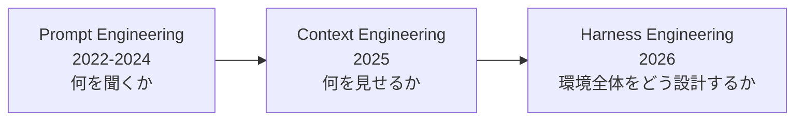

# ハーネスエンジニアリング — モデルではなく環境を設計する

> **TL;DR**: ハーネスはLLMを取り巻く環境・制約・フィードバックループの設計。モデルを変えずにハーネスだけで成功率10倍の事例あり。2026年に業界標準化した概念で、Prompt→Context→Harnessの3時代の最新世代。

## 目次

- [3つの時代の進化](#3つの時代の進化)
- [ハーネスの歴史（タイムライン）](#ハーネスの歴史タイムライン)
- [構成要素（Guard/Context/Tool/Memory/Supervision）](#構成要素guardcontexttoolmemorysupervision)
- [成功率10倍の実証事例](#成功率10倍の実証事例)
- [Anthropicのハーネス哲学](#anthropicのハーネス哲学)
- [業界コンセンサス](#業界コンセンサス)

## 3つの時代の進化

| 時代 | 問い | 最適化対象 |
|---|---|---|
| Prompt Engineering | 何を聞くべきか？ | 指示文 |
| Context Engineering | モデルに何を見せるべきか？ | 入力ウィンドウ全体 |
| Harness Engineering | 環境全体をどう設計すべきか？ | モデルを取り巻くシステム全体 |

包含関係: ハーネス ⊃ コンテキスト ⊃ プロンプト。各層はスコープを追加するが前の層を排除しない。

## ハーネスの歴史（タイムライン）

| 時期 | 出来事 |
|---|---|
| 2024/12 | Anthropic「Building Effective Agents」でscaffoldの概念基盤 |
| 2025/06 | Karpathyがcontext engineeringを提唱 |
| 2025/11 | Anthropic「Effective harnesses for long-running agents」で公式にharness使用 |
| 2026/02 | Mitchell Hashimoto（Terraform創設者）が「harness engineering」と命名 |
| 2026/02 | OpenAIが100万行の実験結果を公開。用語が爆発的に広まる |
| 2026/03 | 学術論文（OPENDEV, NLAH）が相次いで発表。業界標準に |

## 構成要素（Guard/Context/Tool/Memory/Supervision）

「GCTMS」という名称の確立されたフレームワークは見つからなかったが、構成要素として以下の5つが個別に広く議論されている:

| 要素 | 役割 | 比喩 |
|---|---|---|
| **Guard** | 危険な操作を止める | ブレーキ |
| **Context** | 必要な情報を絞って渡す | カーナビ |
| **Tool** | ファイル操作、検索等の操作手段 | ハンドル・ペダル |
| **Memory** | 会話履歴、過去の知識の保持 | 記憶 |
| **Supervision** | 成功率やエラーの監視・改善 | ダッシュボード |

## 成功率10倍の実証事例

### oh-my-pi/Hashline（ツール設計の改善だけで10倍）

| モデル | 従来方式 | Hashline方式 | 改善 |
|---|---|---|---|
| Grok Code Fast 1 | 6.7% | 68.3% | **約10倍** |

モデルは同じ。テキスト編集ツールの設計（編集箇所の固定方式）だけを変えた。低スコアの原因はモデルの能力ではなくパッチ生成・適用の機械的失敗だった。

### LangChain（ハーネス改善でTop 30→Top 5）

- Terminal Bench 2.0: 52.8% → 66.5%
- モデルは一切変えず（GPT-5.2-Codex固定）
- 変えたのはシステムプロンプト、ツール、ミドルウェアhooks

## Anthropicのハーネス哲学

- **「最もシンプルな解決策を見つけよ。必要な場合にのみ複雑さを増やせ」**
- マルチエージェントからシングルエージェントへの簡素化を推進
- Claude Agent SDKを「強力で汎用的なエージェントハーネス」と公式に位置づけ
- 「エージェントを評価するとは、モデルとハーネスを一体として評価すること」

## 業界コンセンサス

- **「モデルはコモディティ、ハーネスが差別化要因」**（Philipp Schmid）
- モデル=CPU、ハーネス=OS、エージェント=アプリケーション
- 「ハーネスはBitter Lessonに耐えるために軽量でなければならない」
- 2025年はエージェントがコードを書けることを証明した年、2026年はエージェントを信頼できるようにする年

## Sources

- [Anthropic - Building Effective Agents](https://www.anthropic.com/research/building-effective-agents)
- [Anthropic - Effective harnesses for long-running agents](https://www.anthropic.com/engineering/effective-harnesses-for-long-running-agents)
- [OpenAI - Harness engineering](https://openai.com/index/harness-engineering/)
- [Mitchell Hashimoto - My AI Adoption Journey](https://mitchellh.com/writing/my-ai-adoption-journey)
- [oh-my-pi - The Harness Problem](https://blog.can.ac/2026/02/12/the-harness-problem/)
- [LangChain - Improving Deep Agents](https://blog.langchain.com/improving-deep-agents-with-harness-engineering/)
- [Martin Fowler - Harness Engineering](https://martinfowler.com/articles/exploring-gen-ai/harness-engineering.html)
- [Philipp Schmid - Agent Harness 2026](https://www.philschmid.de/agent-harness-2026)
