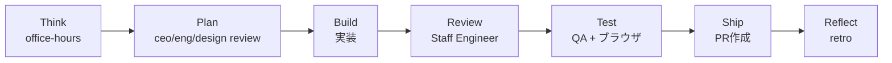

# 人気ハーネスリポジトリの比較と自分たちとの違い

> **TL;DR**: トップ3リポジトリ（115K/54K/44K stars）を調査。それぞれ「最適化」「ロール分化」「コンテキストロット対策」に特化。自分たちの独自性は「設計過程の公開」「認知科学に基づく判断」「反証技法の体系化」。

## 目次

- [トップリポジトリの比較](#トップリポジトリの比較)
- [everything-claude-code — プロダクション品質の最適化](#everything-claude-code--プロダクション品質の最適化)
- [gstack — 1人で20人チームの仕事](#gstack--1人で20人チームの仕事)
- [get-shit-done — コンテキストロット対策のspec駆動](#get-shit-done--コンテキストロット対策のspec駆動)
- [自分たちの独自性](#自分たちの独自性)
- [参考にできる点](#参考にできる点)

## トップリポジトリの比較

|       | everything-claude-code | gstack           | get-shit-done | **自分たち** |
| ----- | ---------------------- | ---------------- | ------------- | -------- |
| Stars | 115K                   | 54K              | 44K           | —        |
| 思想    | プロダクション品質の最適化          | 1人で20人チームの仕事     | コンテキストロット対策   | 使いながら育てる |
| スキル数  | 135+                   | 28               | 50+コマンド       | 11       |
| 作者    | Anthropicハッカソン優勝       | YC CEO Garry Tan | —             | 個人開発者    |

## everything-claude-code — プロダクション品質の最適化

135+スキル、30サブエージェント、60スラッシュコマンド。「コンテキストロットとの戦い」が核心。

- Stop hookで学習内容をスキルとして自動保存（continuous-learning）
- モデル選択をタスク種別で最適化（探索=Haiku、実装=Sonnet、アーキテクチャ=Opus）
- 言語・ドメインごとの深い専門化（業種特化スキルも）
- 997テストでリリース品質を保証

## gstack — 1人で20人チームの仕事



- 6ロール（CEO/Designer/EM/Staff Engineer/QA/CSO）がスキルとして定義
- 実ブラウザQA（Playwright）が中心。CAPTCHAで詰まったら人間にブラウザを渡す`$B handoff`
- 60日で60万行のプロダクションコード
- ETHOS.md: 「90%で良いは過去の思考。常に完全実装を選べ」

## get-shit-done — コンテキストロット対策のspec駆動

- 6ステップ: new-project → discuss → plan → execute → verify → ship
- **Wave-based parallel execution**: PLANを依存関係で分析し、同一Wave内は並列、Wave間は逐次
- 各Planは200kトークンのフレッシュなcontextで実行
- STATE.mdでセッション横断コンテキスト管理
- discuss-phase: 「ユーザーはビジョナリー。技術は聞かない。ビジョンだけ聞く」

## 自分たちの独自性

他のリポジトリにない強み:

| 独自性 | 内容 |
|---|---|
| **設計過程が全部残ってる** | 15本の記事 + 22本のリサーチ + decisions/ideas/。「なぜこうしたか」が全部追える |
| **認知科学に基づく設計判断** | Miller's Law、Hick's Law、二重符号化理論でフォルダ数・文書構造を決めた |
| **反証技法の体系化** | /challengeに検事・監査官の技法、/red-teamに悪意の5段階。他にない |
| **retroフィードバックループ** | スキル自体が使うたびに育つ仕組み。55点→70点→75点 |
| **ナレッジ管理の3性質** | 記録・育てる・蓄積。ドキュメントの性質で管理ルールを分ける |

## 参考にできる点

| リポジトリ | 参考にすべき点 |
|---|---|
| everything-claude-code | Stop hookでの自動学習（continuous-learning）。モデルプロファイル管理 |
| gstack | スキル間でドキュメントを受け渡す「チェーン設計」。ブラウザQA |
| get-shit-done | STATE.mdによるセッション横断コンテキスト管理。Wave並列実行 |

## everything-claude-codeのフォルダ構成詳細（2026-03-29追記）

```
agents/           ← 30個の役割別エージェント（architect, planner, code-reviewer等）
skills/           ← 130+スキル（continuous-learning, verification-loop等）
rules/            ← 言語別ルール12言語（common/にsecurity.md, testing.md等）
commands/         ← 60+スラッシュコマンド
contexts/         ← コンテキスト定義（dev, research, review）
.claude/
  homunculus/
    instincts/    ← AIの「本能」をYAMLで永続化。学習した知見を自動保存
  enterprise/     ← ガードレール設定
  research/       ← リサーチプレイブック
```

### 自分たちとの構成比較

| 概念 | everything-claude-code | 自分たち |
|---|---|---|
| 学習の永続化 | instincts/（YAML、hookで自動保存） | retro.md（手動、2回出たら昇格） |
| ルール管理 | rules/（言語別12フォルダ） | CLAUDE.md（1ファイル） |
| ナレッジ蓄積 | research/（プレイブック） | docs/5フォルダ（/noteで管理） |
| エージェント定義 | agents/（30個） | skills/（11個） |

### lessonsフォルダは存在しない

「学んだこと」専用フォルダはない。代わりに`.claude/homunculus/instincts/`がYAMLで「本能」として永続化する。自動保存 vs 手動+昇格基準（2回出たらルール化）の設計思想の違い。
